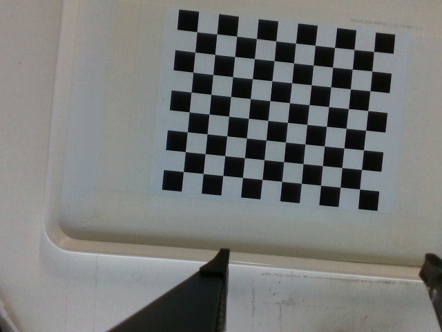
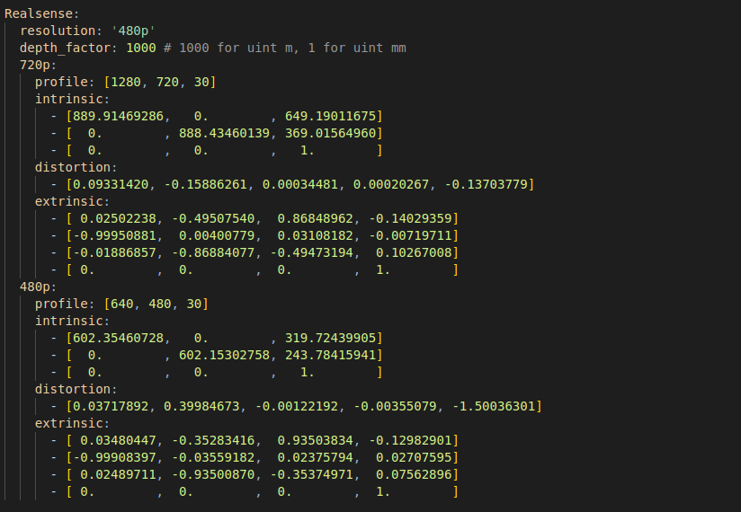

# AIRBOT 视觉抓取与语音控制 Demo

- 完整现场操作：[docs/SOP.md](docs/SOP.md)
- 软件架构说明与架构图：[docs/SOFTWARE_ARCHITECTURE.md](docs/SOFTWARE_ARCHITECTURE.md)

## 目录结构

```text
graspdemo/
├── app/             # GUI、机械臂、视觉与语音源码
├── tests/           # 不连接真实硬件的离线测试
├── docs/            # 操作 SOP 与软件架构说明
├── configs/         # 相机、模型、位姿和控制参数
├── checkpoint/      # MobileSAM 与 YOLO 权重
├── assets/          # 文档图片和架构图
├── fonts/           # GUI 字体
├── packages/        # 部署时放置 arm-sdk wheel 和 airbot-arm deb
├── vendor/legacy/   # 仅留档的旧版依赖，不参与当前安装
├── logs/            # 应用日志
├── runtime/         # 图像、点云和 waypoint 等运行产物
├── install.sh       # 一键安装统一环境
├── run_grasp.sh     # 检查环境或启动程序
└── run_tests.sh     # 运行全部离线测试
```

日常入口都保留在根目录：首次部署运行 `./install.sh`，离线检查运行
`./run_grasp.sh --check`，测试运行 `./run_tests.sh`，现场启动运行
`./run_grasp.sh`。

## Dependencies Installation

新机器推荐把厂商 `arm_sdk-5.2.2-*.whl` 和 `airbot-arm_5.2.2_*.deb` 放入 `packages/`，然后只执行：

```bash
./install.sh
```

安装包位于其他目录时仍是一条命令：

```bash
./install.sh --sdk-wheel /path/to/arm_sdk-5.2.2-py3-none-any.whl \
  --arm-deb /path/to/airbot-arm_5.2.2_amd64.deb
```

完整安装和排障步骤见 [docs/SOP.md](docs/SOP.md)。
### Hand-Eye Calibration
**Note:** Default calibration resolution is 480p. Modify `configs/sam_simplegrasp.yaml` to change settings.

#### Run arm server
```bash
sudo airbot-arm -i can0 -t airbot_play_g2 --address 0.0.0.0:50051 --no-return
```
#### Run calib

The calibration board is a 9×11, 20mm black and white chessboard pattern calibration board.

```bash
./venv/bin/python app/airbot_calibration.py  # Use -h flag for help options
```
Drag arm to change robot pose, make sure that the chessboard in the camera view, Press `ESC` to capture img and pose.

Calibration Suggestions:Capture images from as many different orientations and positions as possible during calibration. Be careful not to move the arm to its limit positions.



After calibration completes,  The calibration results will be displayed in the command line ,update the corresponding parameters in `configs/sam_simplegrasp.yaml` with the calibration results.


You can use the following reference parameters under the conditions mentioned below.

Calibration Setup: The arm and the calibration board are placed on a white table at a height of 74.5 cm, and both are on the same plane.


```
480p:
    profile: [640, 480, 30]
    intrinsic:
      - [604.77563127,   0.        , 318.34741824]
      - [  0.        , 604.65868699, 249.83140396]
      - [  0.        ,   0.        ,   1.        ]
    distortion:
      - [0.04401480, 0.47978715, -0.00054849, -0.00361947, -1.93856636]
    extrinsic:
      - [ 0.00564713, -0.36529553,  0.93087447, -0.15035552]
      - [-0.99998351, -0.00109528,  0.00563656,  0.03493759]
      - [-0.00103944, -0.93089096, -0.36529570,  0.10947199]
      - [ 0.        ,  0.        ,  0.        ,  1.        ]
```


#### Run grasp app
```bash
./run_grasp.sh
```

#### Run arm server if not running

```bash
sudo airbot-arm -i can0 -t airbot_play_g2 --address 0.0.0.0:50051 --no-return
```

Basic Usage:

Click "Capture" to take a snapshot of the scene. Then click on the object in the image at the lower-left corner, and click "Pick and Place" to automatically recognize and perform the grasping action.


The basic graspable area is shown in the figure below, covering approximately 80% of the workspace.


#### Debug

1. If the observe pose and place pose need to be changed, you can enter gravity compensaton mode, drag arm to the property pose, and copy the pose, Modify them in the `config/sam_simplegrasp.yaml`


## 语音控制抓取 demo

主界面会实时检测积木并区分蓝色/绿色。语音“抓取蓝色积木”或“抓取绿色积木”会选择唯一有效目标，使用 MobileSAM 框选分割并进入现有抓取/放置流程。机械臂使用 `arm-sdk 5.2.2` 和 `airbot-arm 5.2.2`。

处理流程：常驻 FunASR 转文字 → 安全白名单/常见错词校正 → 实时 YOLO 积木定位 → HSV 蓝/绿判定 → MobileSAM 分割 → 抓取位姿 → `arm-sdk 5.2.2`。

这一版不需要 OpenAI、DeepSeek、公司 API key 或 Ollama。首次使用 ASR 可能从 ModelScope 下载模型；缓存完成后语音识别在本机运行。不会把语音转换成任意 Python 或 shell 代码。

### 支持的口令

| 口令示例 | 实际行为 |
| --- | --- |
| 拍照 / 捕获图像 | 捕获相机图像，清除旧目标，需要重新点击选择物体 |
| 预测抓取 / 预测抓取位姿 | 根据已选分割区域计算抓取位姿，不驱动机械臂 |
| 开始抓取 / 抓取选中物体 / 抓取并放置 | 重新预测，然后调用原有 Pick and Place 流程 |
| 抓取蓝色积木 | 抓取实时画面中唯一有效蓝色积木 |
| 抓取绿色积木 | 抓取实时画面中唯一有效绿色积木 |
| 打开夹爪 / 张开夹爪 | 明确发送打开命令，不是切换开合状态 |
| 关闭夹爪 / 合上夹爪 | 明确发送关闭命令 |
| 回到观察位 / 返回观察位 | 调用原有观察位移动函数 |

可以说“请打开夹爪”“请帮我抓取蓝色积木”。“打开假爪”“打 开 假 找”等已审核的 ASR 错词会被校正。否定句、疑问句、转述、组合指令和无关环境语音不会执行。

实时目标需连续 3 帧确认后才进入界面，检测框会做位置平滑，偶发漏检最多保持 3 个检测周期；颜色使用最近 5 帧投票，不会因单帧颜色波动立即切换。目标状态区域固定为两行，不会因候选数量改变而推动下方语音控件。较长识别文本中若只含一个完整白名单口令，程序会提取该口令，但此类“背景文本提取”结果必须手动确认，不能自动执行。

当画面中有多个同色积木时，颜色指令不足以确定唯一目标，程序会拒绝运动。鼠标拍照/点选保留在“手动备用”标签页。不支持红色、方位词或任意物体描述。

### 1. 先验证输入，不连接机械臂

以下指令仅输出解析结果，不导入 SDK，不初始化相机，不驱动机械臂：

```bash
cd /home/su/graspdemo
PYTHONPATH=app ./venv/bin/python app/voice_commands.py --text '打开夹爪'
PYTHONPATH=app ./venv/bin/python app/voice_commands.py --text '开始抓取'
PYTHONPATH=app ./venv/bin/python -m unittest -v tests.test_voice_commands
```

检查项目统一环境和麦克风：

```bash
./venv/bin/python -m sounddevice
./run_grasp.sh --check
```

`sounddevice` 会列出可用设备；选择带输入通道的麦克风。`--check` 只验证环境，不会打开麦克风、相机或驱动机械臂。实际录音在 GUI 中验证，首次保持自动执行关闭。

### 2. 启动原有抓取环境和服务

抓取 GUI、实时视觉和 FunASR 语音子进程统一使用项目 `venv`。新机器执行一次 `./install.sh` 即可安装系统录音依赖、Python 依赖、arm-sdk 5.2.2 并缓存语音模型。旧的独立语音环境不再参与启动流程；确认统一环境稳定后可自行删除。

先核对 `configs/config_file.yaml` 指向的配置文件中 `ArmParams.port`。当前 `configs/sam_simplegrasp.yaml` 是 **50051**，所以服务示例是：

```bash
sudo airbot-arm -i can0 -t airbot_play_g2 --address 0.0.0.0:50051 --no-return
```

如果已有服务且端口一致，不要重复启动。CAN 配置、服务参数沿用你已经验证过的实际硬件配置，并始终与配置文件端口保持一致。

另开终端运行：

```bash
cd /home/su/graspdemo
./run_grasp.sh
```

`run_grasp.sh` 会直接使用项目 `venv` 同时运行视觉和语音，不受当前终端激活环境影响。首次运行前可用 `./run_grasp.sh --check` 做离线检查；更换麦克风可用 `./run_grasp.sh --device 10`（默认编号为 `11`）。脚本不会自动启动需要 `sudo` 的 `airbot-arm` 服务。

语音工作脚本默认为项目内 `app/voice_asr_worker.py`。启动 GUI 时模型预加载一次；就绪后点击录音会立即开始，说完后约 0.8 秒静音即提前结束，“最长”只是保护上限。

**注意：GUI 启动时会移动到配置的观察位，该动作不受语音确认控制。** 启动前必须确认观察位、放置位、标定及周围空间安全。不要在未准备好的机械臂上用启动 GUI 的方式做离线测试。

### 3. 实际操作

1. 初次测试不要勾选“高可信识别后直接执行”，速度设为 `SLOW`。
2. 检查实时画面对蓝/绿积木的检测框和右侧覆盖率，先完成现场 HSV 校准。
3. 只放置一个蓝色积木，说“抓取蓝色积木”，核对文字后点击确认。
4. 蓝色成功后只放置一个绿色积木，说“抓取绿色积木”。
5. 放置两个同色积木，确认程序提示不唯一并且不运动。
6. 手动拍照和点选位于“手动备用”标签，不是日常颜色抓取的必需步骤。

不方便录音时，可以在同一文字框输入口令并点击执行，调用的是同一指令入口。

确认识别准确、硬件工作区安全后，可以勾选“语音识别后直接执行”：之后每次点击录音、说出口令、识别成功后，就会直接调用对应动作，无需再点执行。该开关默认关闭，不跨程序启动保存。不支持持续监听或唤醒词。

### 限制与安全边界

- “取消本次语音”只取消录音/识别并丢弃结果，**不是机械臂急停**。语音“停止”不映射到硬件急停；紧急情况使用硬件急停或既有控制器的停止方式。
- 自动抓取模式或抓取线程运行时，新语音任务会被拒绝，不排队。录音/识别期间暂时禁用原控制按钮和鼠标选取，防止识别中途更换目标。
- 重新拍照、清除选取或分割失败会清除旧掩码和预测；手动移动、夹爪操作和抓取开始会使目标快照失效。需要重新拍照选取，防止使用旧目标。
- 预测失败不会启动抓取线程。新增输入保护并不取代机械臂控制器的限位、碰撞防护或现场安全措施。
- ASR 常驻在独立子进程，不阻塞界面；实测冷启动约 8.29 秒，每次录音不再重新加载模型。
- YOLO 只提供 `block/cube` 定位，颜色来自 HSV 后处理。阈值必须在实际积木和照明下校准。
- 最终抓取位姿的 Z 值不会低于 `AirbotGrasp.min_grasp_z`；当前按修正后的现场参考位置设为 `0.01338870424854599 m`。该值是工具中心在机械臂基座坐标系中的最低抓取 Z，不是积木高度。
- 抓取运动先单点规划到目标上方 10 cm，再使用 SDK 直线末端运动下降和抬升；任一步规划失败都会停止后续动作，并在日志中显示失败阶段及目标位姿。
- 机械臂离开观察位后若任务失败，会先按所在区域直线上抬到安全位，再自动尝试返回初始观察位；恢复失败会保留原始异常并输出单独诊断。
- 蓝色和绿色积木共用 `AirbotGrasp.place_pose`。当前公共放置位为 `[0.2512875752, 0.2064111500, 0.0831953869]`；机械臂先到其正上方 10 cm，再直线下降、松爪并直线抬升。
- 自动抓取不再把夹爪阻塞式关闭到零位。程序使用 `eef_eff` 发送可配置的夹持力，并轮询 `eef_pos/eef_vel/eef_eff`：夹爪停在目标宽度之外、速度接近零且作用力达到阈值，连续 3 次即判定“已夹住”并抬升。超时未接触或末端电机错误时不会继续搬运。
- 实时 YOLO、MobileSAM/位姿计算和机械臂任务使用独立工作线程；窗口响应仍不是硬件急停保障。

### 常见问题和测试

- 找不到语音 Python 或脚本：执行 `./install.sh`，并检查项目内 `app/voice_asr_worker.py`。
- 麦克风无效或没有声音：重新运行 `--list-devices`，选择有输入通道的设备；不要选择 HDMI 输出设备。
- 提示缺少 `sounddevice` / `funasr`：执行 `./install.sh --skip-system` 修复项目统一环境。
- GUI 提示缺少 PyQt6、SDK 或视觉模块：检查原抓取环境，并按前面的抓取安装说明补齐，这与 API key 无关。
- 识别成功但没有运动：默认需要点执行；也检查是否为支持的口令、是否仍在自动模式、是否已拍照选中目标、是否预测失败。面板中的“已调用指令入口”不表示机械臂已经完成动作，执行结果以原有日志及现场状态为准。

基础测试不需要 GUI 依赖；完整输入面板测试需要 PyQt6，但不需要相机、麦克风、模型或机械臂：

```bash
cd /home/su/graspdemo
QT_QPA_PLATFORM=offscreen PYTHONPATH=app ./venv/bin/python -m unittest -v tests.test_voice_commands tests.test_voice_panel
```

相关文件：`app/voice_commands.py`（白名单、错词与安全分发）、`app/voice_asr_worker.py`（常驻 FunASR/录音）、`app/voice_panel.py`（语音 UI 与 JSON 协议）、`app/airbot_yolo.py`（实时候选与 HSV 颜色）、`app/airbot_interface.py`（快照、分割、抓取编排）及 `tests/` 下对应离线测试。FunASR 与视觉程序共用项目 `venv`，模型缓存仍位于当前用户的 ModelScope 缓存目录。
