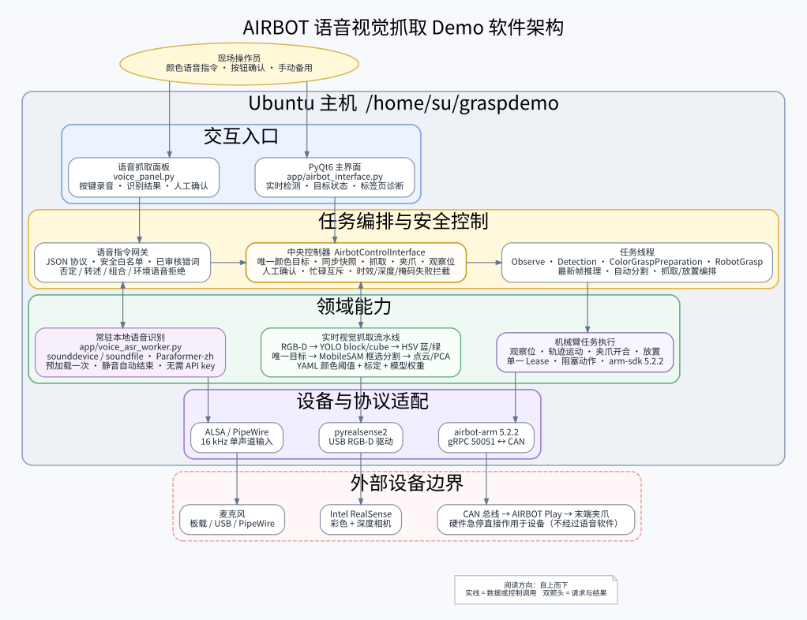

# AIRBOT 语音视觉抓取软件架构



可编辑源图：[voice_grasp_architecture.dot](../assets/voice_grasp_architecture.dot)  
PNG 版本：[voice_grasp_architecture.png](../assets/voice_grasp_architecture.png)

## 分层说明

| 层级 | 主要模块 | 职责 |
| --- | --- | --- |
| 表现与交互层 | PyQt6 GUI、实时检测画面、颜色目标状态、语音面板、备用手动页、诊断日志 | 展示实时候选、识别文字、忙碌/过期/歧义与执行状态 |
| 业务编排与安全层 | `AirbotControlInterface`、检测/位姿/抓取 QThread、`app/voice_commands.py` | 安全模糊解析、唯一目标、时效、分割/深度检查、忙碌互斥、单一 Lease |
| 视觉与抓取算法层 | `RealsenseCamera`、YOLO、HSV 颜色分类、MobileSAM、`SimpleGrasp` | 实时最新帧检测、蓝/绿颜色判定、框选分割、同步 RGB-D/位姿和点云/PCA |
| 语音服务层 | `QProcess`、`app/voice_asr_worker.py`、sounddevice、FunASR | 会话内只加载一次模型，按键开始录音，说完静音自动结束，通过 JSON 协议返回文本 |
| 就近资源 | YAML、模型权重、运行记录 | 资源随对应语音、视觉或执行模块展示，不再用跨层连线表示 |
| 设备与协议适配层 | `arm-sdk 5.2.2`、`airbot-arm 5.2.2`、pyrealsense2、ALSA/PipeWire | 将应用调用转换成机器人、相机和麦克风设备接口 |
| 外部设备边界 | 麦克风、RealSense、AIRBOT Play、夹爪、CAN | 真实硬件及其物理运动边界 |

## 主要链路

语音控制链路：

```text
操作者 → 语音面板 → 常驻 FunASR 进程 → JSON 文本
       → 白名单/错词校正/否定与环境语音过滤 → 蓝/绿目标请求
       → 同步 RGB-D/位姿 + YOLO 框 + HSV 颜色 + MobileSAM 掩码
       → arm-sdk 5.2.2 → airbot-arm 5.2.2 → CAN → 机械臂/夹爪
```

视觉抓取链路：

```text
RealSense RGB-D → RealsenseCamera → 快照 → 鼠标目标提示
→ MobileSAM 掩码 → 点云生成与坐标变换 → PCA 抓取位姿
→ RobotGraspThread → 抓取/放置轨迹 → AIRBOT Play
```

## 设计边界

- FunASR 只输出文字，当前流程不调用大语言模型，也不需要 API key。
- 语音文本只能匹配固定指令与已审核错词，弱模糊结果必须人工确认，文本不能成为 Python、shell 或 SDK 的任意参数。
- 默认需要人工核对识别文本后再执行；自动执行是显式勾选项。
- YOLO 只定位 `block/cube`，HSV 只分类已配置的蓝/绿颜色；多个同色目标、未知颜色、过期目标或无效深度都不会运动。
- 抓取线程运行或自动模式启用时，新语音任务被拒绝且不排队。
- GUI 只创建一个持有 Lease 的运动客户端；观察线程使用不获取控制权的只读客户端。
- 硬件急停位于软件边界之外；取消录音不能中止已经发出的机械臂运动。

## 重新生成图

系统已安装 Graphviz 时，在项目目录运行：

```bash
cd /home/su/graspdemo
dot -Tsvg assets/voice_grasp_architecture.dot \
  -o assets/voice_grasp_architecture.svg
dot -Tpng -Gdpi=160 assets/voice_grasp_architecture.dot \
  -o assets/voice_grasp_architecture.png
```
